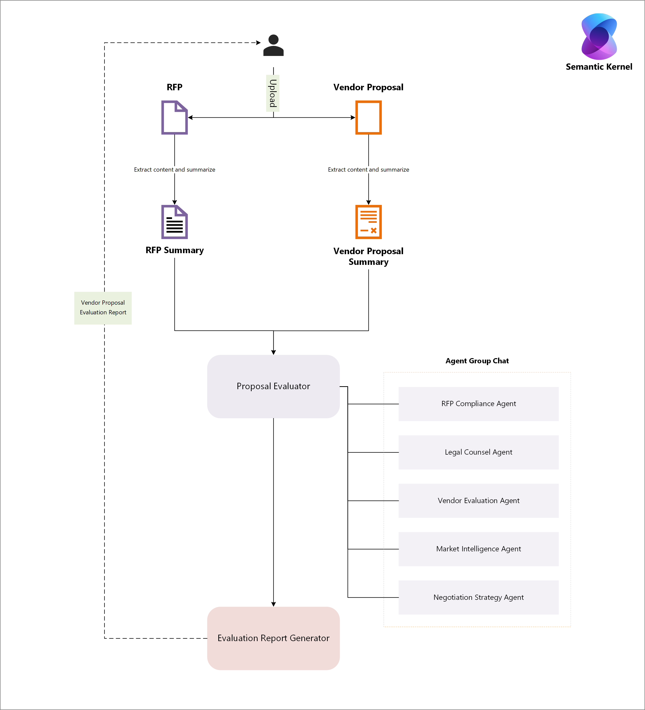

# 🤖 AI-Powered RFP Analyzer: An Azure-Based Multi-Agent Accelerator for RFP & Proposal Evaluation Using Semantic Kernel

A turnkey, multi-agent solution accelerator for automating the evaluation of RFPs/RFTs and Vendor/Supplier Proposals. This accelerator helps procurement teams reduce manual effort, ensure compliance, analyze vendor capabilities, and generate strategic negotiation recommendations—delivered as a structured, final evaluation report ; all deployed in your Azure tenant in under an hour.

---

## 🔍 Table of Contents

- [✨ Features](#✨-features)  
- [📐 Architecture](#📐-architecture)  
- [⚙️ Tech Stack](#⚙️-tech-stack)  
- [☁️ Provisioned Azure Services](#☁️-provisioned-azure-services)  
- [🔧 Environment Variables](#🔧-environment-variables)  
- [🚀 Step-by-Step Deployment](#🚀-step-by-step-deployment)
- [🤝 Contributing](#🤝-contributing)  
- [📄 License](#📄-license)  

---

## ✨ Features

The **AI-Powered RFP Analyzer** combines modular AI agents, LLM orchestration with Semantic Kernel Agent Framework, and vector-based reasoning to deliver a complete procurement intelligence system. Each feature corresponds to a specialized agent that independently analyzes vendor/supplier proposals and contributes to a unified evaluation.

---

### 🧾 RFP/RFT Compliance Scoring Agent
Evaluate how well a Vendor or Supplier Proposal aligns with the original RFP/RFT document:
- Extracts and compares proposal content against mandatory RFP requirements.
- Identifies key gaps or misalignments in scope, deliverables, or terms.
- Assigns a **compliance score (1–10)** based on completeness and relevance.
- Highlights critical missing elements that may disqualify the vendor.

---

### ⚖️ Legal & Regulatory Risk Assessment Agent
Ensure the proposal meets internal policies and external regulatory standards:
- Cross-references legal clauses using an Azure-hosted vector index of procurement laws and policies.
- Flags missing or non-compliant sections such as liability, dispute resolution, or contract termination terms.
- Outputs a **risk level: Low, Medium, or High**, with a structured explanation.
- Helps legal and procurement teams pre-empt contractual risks.

---

### 🏢 Vendor Reputation & Stability Evaluation Agent
Assess the historical performance, financial stability, and credibility of vendors:
- Reviews past projects, industries served, customer satisfaction, and compliance history.
- Integrates with sample vendor vector indexes (or real data) for factual reputation signals.
- Produces a **reputation score (1–10)** reflecting reliability, experience, and maturity.
- Avoids speculative or price-driven assessments—focuses purely on track record and signals.

---

### 🌍 Market Intelligence Integration Agent
Incorporate contextual industry insights to inform strategic decision-making:
- Simulates or integrates with APIs to gather market conditions.
- Benchmarks the vendor against competitors, highlighting differentiators or red flags.
- Evaluates macro risks such as economic conditions, supply chain volatility, or regulatory trends.
- Outputs a **market risk rating (Low, Medium, High)** with supporting narrative.

---

### 🧠 Negotiation Strategy Generator Agent
Craft actionable negotiation strategies tailored to each vendor:
- Synthesizes insights from compliance, legal, vendor, and market agents.
- Identifies leverage points (e.g. gaps, dependencies, differentiators).
- Recommends a strategy type: **Defensive**, **Balanced**, or **Aggressive**.
- Provides structured suggestions for mitigation, incentives, and fallback positions.

---

### 📊 Final Evaluation Report Compilation Agent
Consolidate all agent outputs into a clear, concise, and decision-ready report:
- Aggregates findings into a unified assessment with supporting justifications.
- Assigns a **final vendor score (1–10)** indicating overall suitability and risk level.
- Includes highlights, concerns, and strategic recommendations.
- Outputs a Markdown or PDF document for stakeholder circulation.

---

Together, these features allow procurement teams to move faster, reduce subjectivity, ensure compliance, and drive stronger vendor outcomes with confidence.

## 📐 Architecture

### 🔹 High-Level Infrastructure


- **User Interaction**: End users interact via a web browser to upload documents and trigger evaluations.
- **Azure Container Apps Environment**: Hosts the core containerized Python application.
- **Worker Container App**: Runs the multi-agent logic for evaluation and reporting.
- **Connected Azure Services**:
  - **Azure OpenAI** – Powers the intelligent agents using GPT-based models.
  - **Azure AI Search** – Enables semantic and vector-based retrieval of indexed data.
  - **Azure Document Intelligence** – Extracts structured data from RFPs and proposals.
  - **Azure Storage Account** – Stores document inputs and intermediate outputs.
  - **Azure Container Registry (ACR)** – Hosts the application’s Docker image.
  - **Azure Storage Account** – Stores uploaded documents and temporary data.

---

### 🔹 Solution Workflow



1. **📤 Upload**  
   Users upload RFPs and Vendor/Supplier Proposals via the web interface or API.

2. **📄 Document Parsing & Summarization**  
   The system extracts and summarizes content from both documents using Azure Document Intelligence.

3. **🤖 Multi-Agent Evaluation**  
   The `Semantic Kernel Orchestrator` initiates an agent group chat with specialized agents:
   - **RFP Compliance Agent**: Compares the proposal against RFP requirements.
   - **Legal Compliance Agent**: Identifies legal and regulatory risks.
   - **Vendor Evaluation Agent**: Assesses vendor reputation, stability, and performance.
   - **Market Intelligence Agent**: Evaluates market trends and competitive risks.
   - **Negotiation Strategy Agent**: Recommends negotiation approaches based on findings.

4. **📊 Report Generation**  
   The `Evaluation Report Generator Agent` consolidates all agent assessments into a final, structured **Vendor Proposal Evaluation Report**, including scores, risks, and recommendations.

---

## ⚙️ Tech Stack

- **Language**: Python 3.12.10  
- **Containerization**: Docker
- **Infrastructure-as-Code**: Bicep (located in `/infra` folder)  
- **Deployment Target**: Azure Container Apps  
- **Source Code**: Located in `/src` folder  
- **Image Registry**: Azure Container Registry  
- **Multi-Agent Orchestration**: Semantic Kernel
- **LLM Integration**: Azure OpenAI
- **Document Parsing**: Azure Document Intelligence  
- **Search/Indexing**: Azure AI Search (Vector + Semantic)

---

## ☁️ Provisioned Azure Services

The Bicep templates provision the following Azure resources:

- **Azure Container Apps** – Hosts the containerized multi-agent Python app.
- **Azure Container Apps Environment** – Provides isolated execution for the app.
- **Azure Container Registry (ACR)** – Stores and serves the app container image.
- **Azure Document Intelligence** – Extracts structured data from RFP documents.
- **Azure OpenAI** – Powers intelligent agents using GPT-based models.
- **Azure AI Search** – Enables semantic and vector-based search across processed content.
- **Azure Storage Account** – Stores uploaded documents and temporary data.

---

## 🔧 Environment Variables

Environment variables are used to configure service connections and runtime behavior. These are typically managed by AZD and include:

- `AZURE_OPENAI_ENDPOINT`
- `AZURE_OPENAI_KEY`
- `AZURE_SEARCH_SERVICE_NAME`
- `AZURE_STORAGE_ACCOUNT`
- `AZURE_FORM_RECOGNIZER_ENDPOINT`

You can set or review these in `.env` or via the `azd env` commands.

---

## 🚀 Step-by-Step Deployment

Follow these steps to deploy the solution using AZD:

### 1. Prerequisites

- [Azure Developer CLI (AZD)](https://learn.microsoft.com/en-us/azure/developer/azure-developer-cli/install-azd)
- [Docker Desktop](https://www.docker.com/products/docker-desktop/)
- [Azure CLI](https://learn.microsoft.com/en-us/cli/azure/install-azure-cli)
- The accelerator expects two vector-indexes created on Azure AI Search to facilitate the run of *Legal Compliance Agent* and *Vendor Evaluation Agent*, named *legal-policy-index* and *supplier-insights-index* respectively. Please customize and create them per your use-case data or use the sample documents available under src/documents/sample-docs/index-creation.

## 🚀 Step-by-Step Deployment

Follow the instructions below to deploy the **AI-Powered RFP Analyzer** into your Azure environment using [Azure Developer CLI (AZD)](https://learn.microsoft.com/en-us/azure/developer/azure-developer-cli/install-azd). This guide ensures a clean and repeatable deployment flow.

---

### 🔹 1. Clone the Repository

Start by cloning the repository to your local machine:

```terminal
git clone https://github.com/aadrikasingh/AI-Powered-RFP-Analyzer.git
cd AI-Powered-RFP-Analyzer
```

---

### 🔹 2. Log in to Azure

Ensure you're authenticated with your Azure account via the Azure CLI:

```terminal
az login
```

This will open a browser window prompting you to sign in with your Azure credentials.

> ✨ **Note**: If the browser does not open automatically, copy the provided URL and paste it into your browser manually. Then enter the one-time code shown in your terminal.

Once authenticated, your terminal will confirm your login and list the available subscriptions.

---

### 🔹 3. Set Up Environment Variables

Before deploying, configure the required environment variables.

📄 **Sample file location**:`src/.env.sample`

📅 **Create your working `.env` file**:

```
copy src/.env.sample to src/src/.env
```

you can edit .env you created with your specific values as shown below.

#### ✅ Mandatory Environment Variables

| Variable Name              | Description                                                                      |
| -------------------------- | -------------------------------------------------------------------------------- |
| `AZURE_AI_SEARCH_ENDPOINT` | The endpoint URL of your Azure AI Search instance                                |
| `AZURE_AI_SEARCH_API_KEY`  | Admin or query key for your Azure AI Search instance                             |
| `LEGAL_POLICY_INDEX`       | Name of the index containing legal/policy documents (e.g., `legal-policy-index`) |
| `SUPPLIER_INDEX`           | Name of the supplier insights index (e.g., `supplier-insights-index`)            |

> 💡 You can use the provided default values in `.env.sample` if you have matching indexes already created in your Azure AI Search resource.

---

### 🔹 4. Initialize and Deploy the Environment

Use the Azure Developer CLI to initialize and deploy your solution.

#### 🛠️ Initialize the AZD Environment

```terminal
azd init
```

You will be prompted to enter an environment name. This name will be used as a prefix for all provisioned Azure resources.

> 📌 **Example**:> If you enter `dev`, your container app name might look like `ca-dev-hlukwx2gjy4lo`, where:
>
> - `ca` = Container App
> - `dev` = Environment name
> - `hlukwx2gjy4lo` = Random string for uniqueness

---

#### 🚀 Deploy the Solution

```terminal
azd up
```

You will be prompted to:

1. Select an Azure Subscription to use for deployment.
2. Select a deployment region.

> 🌍 **Recommended Region**: Use a region that supports all required services, such as **Sweden Central**.

Once confirmed, AZD will begin provisioning the infrastructure using Bicep templates. This includes:

- Azure Container Apps
- Azure OpenAI (OpenAI will provision two models: text-embedding-ada-002 and gpt-4o. Both models will have 10,000 TPM. If you want to change this value, go to the OpenAI Bicep module and decrease the capacity number in the model's SKU configuration)
- Azure AI Search (if you are using an exisiting Ai search service then you can remove the Ai search provioned thourgh bicep template)
- Azure Document Intelligence
- Azure Container Registry (ACR)
- Monitoring (Log Analytics & Application Insights)

> ⏱️ Provisioning typically takes **5–10 minutes**, depending on your region and resource availability.

>✅ Once the AZD template deployment completes, a URL will be displayed in your terminal output.
You can use this URL to launch and explore the AI-Powered RFP Analyzer web application in your browser.

### 🔹 4. Removing the solution

Run azd down to remove the Infra and app provioned throgh this template.

```terminal
azd down
```

## 🤝 Contributing

We welcome contributions to enhance and evolve the **AI-Powered RFP Analyzer** accelerator. To get started:

- Fork the repo
- Create a feature branch
- Make your changes
- Push and open a PR

## 📄 License

This project is licensed under the [MIT License](LICENSE).
> ⚠️ **Note**: This solution is intended for internal Microsoft use as an accelerator for proofs of concept (POCs) and demo environments. It is not a production-ready offering. Use at your own discretion.