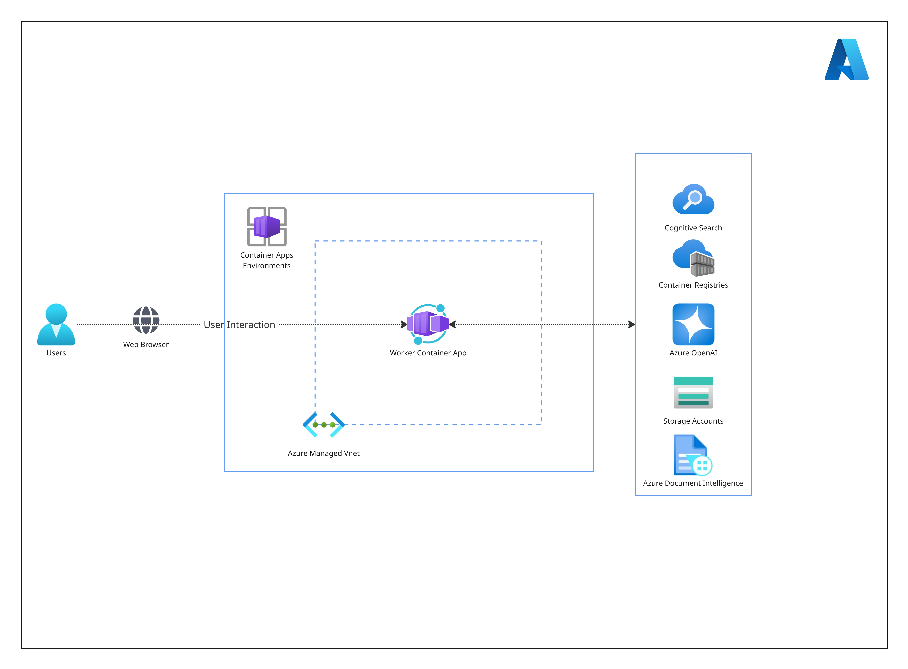

# Multi-Agent RFP Analyzer

 template that provisions a complete infrastructure and a containerized Python-based solution to analyze RFP documents using advanced AI services. [this just a sample description]

---

## Features

<!-- Add key features of the solution here -->

---

## Implementation Details

<!-- Add details of the solution here -->

## Architecture



### Tech Stack

- **Language**: Python 3.12.10  
- **Containerization**: Docker (Docker Desktop or CLI)  
- **Infrastructure-as-Code**: Bicep (located in `/infra` folder)  
- **Deployment Target**: Azure Container Apps  
- **Source Code**: Located in `/src` folder  
- **Image Registry**: Azure Container Registry  

---

### Provisioned Azure Services

The Bicep templates provision the following Azure resources:

- **Azure Container Apps** – Hosts the containerized multi-agent Python app.
- **Azure Container Apps Environment** – Provides isolated execution for the app.
- **Azure Container Registry (ACR)** – Stores and serves the app container image.
- **Azure Document Intelligence** – Extracts structured data from RFP documents.
- **Azure OpenAI** – Powers intelligent agents using GPT-based models.
- **Azure AI Search** – Enables semantic and vector-based search across processed content.
- **Azure Storage Account** – Stores uploaded documents and temporary data.

---

### Environment Variables

Environment variables are used to configure service connections and runtime behavior. These are typically managed by AZD and include:

- `AZURE_OPENAI_ENDPOINT`
- `AZURE_OPENAI_KEY`
- `AZURE_SEARCH_SERVICE_NAME`
- `AZURE_STORAGE_ACCOUNT`
- `AZURE_FORM_RECOGNIZER_ENDPOINT`

You can set or review these in `.env` or via the `azd env` commands.

---

## Step-by-Step Deployment

Follow these steps to deploy the solution using AZD:

### 1. Prerequisites

- [Azure Developer CLI (AZD)](https://learn.microsoft.com/en-us/azure/developer/azure-developer-cli/install-azd)
- [Docker Desktop](https://www.docker.com/products/docker-desktop/)
- [Azure CLI](https://learn.microsoft.com/en-us/cli/azure/install-azure-cli)

### 2. Clone the Repository

```bash
# Clone the repository
git clone https://github.com/aadrikasingh/AI-Powered-RFP-Analyzer.git
cd into the clones repo (AI-Powered-RFP-Analyzer)

# Login to Azure
az login

# Initialize AZD environment (optional to specify a name)
azd init
azd env new <environment-name>  # Optional

# Deploy the solution
azd up


